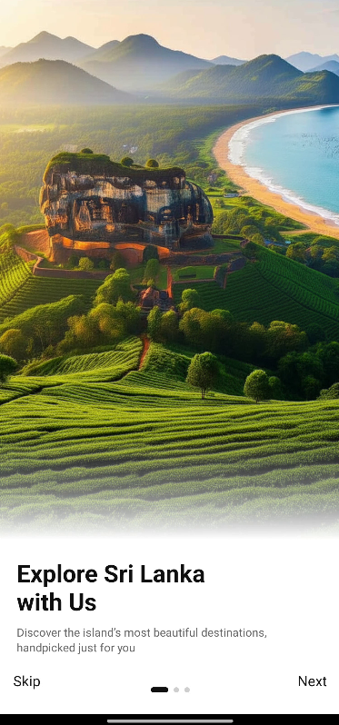
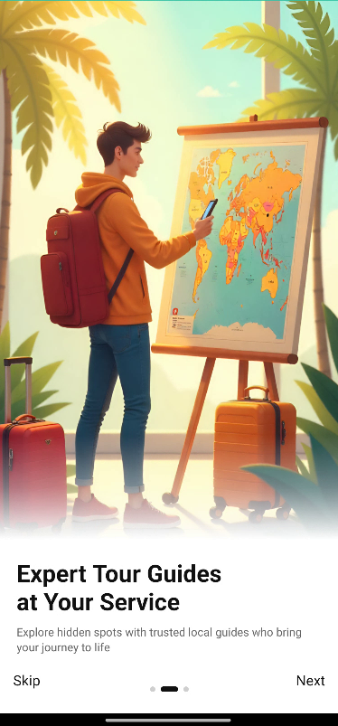
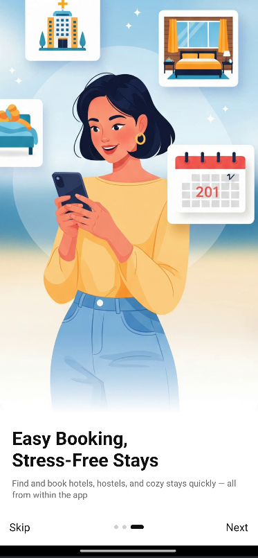
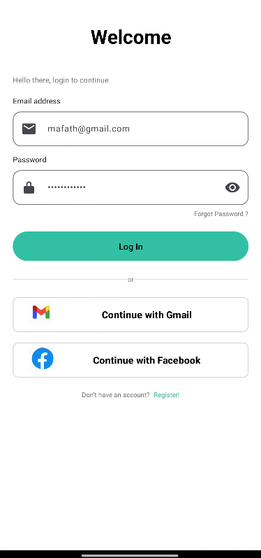
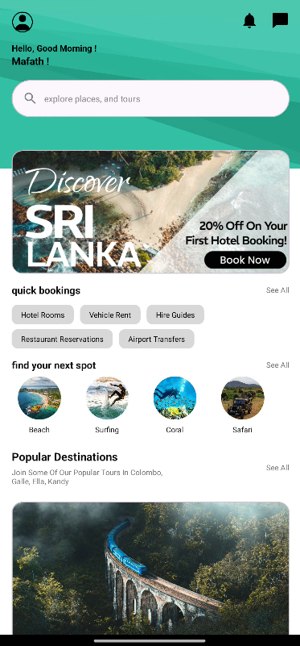
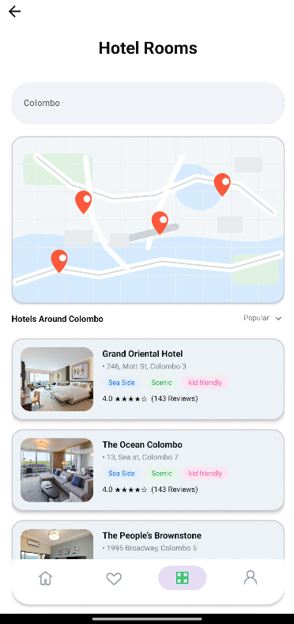
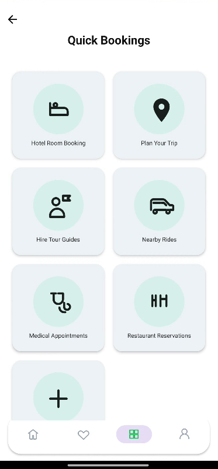
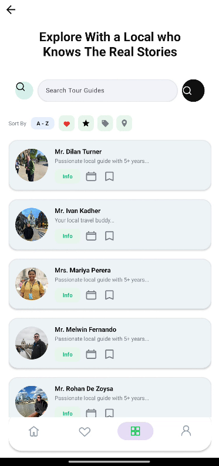

# 🚀 TourEase — Seamless Tour & Guide Booking

**Discover, book and manage tours with local guides — fast and simple.**

---

## 🎯 What is TourEase?

**TourEase** is an Android app for discovering local guides and booking tours. It focuses on a clean Material UI, quick booking flows, and features that make touring easy for both guests and guides.

### ✨ Key Features

- **Guide Profiles:** View guide bios, ratings, photos and availability.
- **Calendar Booking:** Select dates with a built-in calendar dialog and check availability.
- **In-app Booking:** Secure, one-tap booking and price overview.
- **Ratings & Reviews:** See guide ratings and leave feedback.
- **Profile Tags & Filters:** Filter guides by skills, languages and tags.

---

## 🚀 Project Highlights

- **Kotlin first**: Modern Android development using idiomatic Kotlin.
- **Material Design**: Components from Material library for consistent UI.
- **View Binding**: Type-safe view access and fewer crashes.
- **Modular UI**: Activities and Fragments for clear separation.

---

## 🛠️ Tech Stack & Key Dependencies

**Core**
- `Kotlin` — primary language
- `Android SDK` — targeted from 24+

---

## 📸 Screenshots

	
	
	
	

	
	
	
	

	

---
